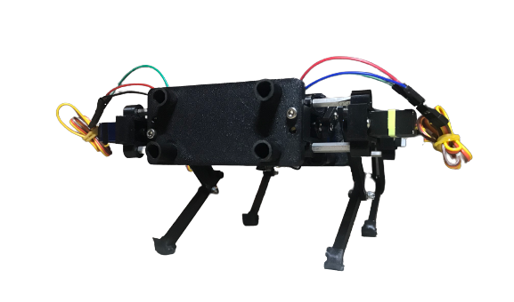

# A Quadruped Robot Study
For my senior capstone project my team developed a low-cost quadruped. Given a budget of $300 the team aimed at lowering the entry to engage in robotics for future CSULB students. Thus, we centered our quadruped around an Arduino Pro Micro with a 3D-printed structure. I taught the basics of Arduino coding, facilitated group literature reviews, and led all control integration.

Check out our [Project Poster](assets/poster.pdf) and our [Project video](https://www.youtube.com/watch?v=XFA9bQ_TH7U)

  

## Team Members
- Long N. (Design Lead)
- **Samid C.** (Control Systems Lead)
- Susan S. (Designer)
- Su (Steve) Cheol S. (Programmer)
- Huukie T. (Designer)
- Daniel P. (Designer)

## Repo Structure

main 3 subdirectories:

- arduino-code/ - all code that embeds life to our quadruped

- python-code/ - code for data acqusition

- matlab-code/ - code used for data analysis and visualization

## Bill of Materials

| Part                 | Description                                       | Purchase Quantity | Total Cost |
| -------------------- | ---------------------------------                 | ----------------- | ---------- |
| [MG92B](https://www.adafruit.com/product/2307?gclid=CjwKCAjwp8OpBhAFEiwAG7NaEr2StVQj5ZbsFX6eUbTgtrtlry9KsD3TUezsS-bsu2vypxqO1LqEjxoCXX0QAvD_BwE)                | Servo Motors                                      | 6                | $71.70     |
| [MPU-9250](https://www.seeedstudio.com/Grove-IMU-9DOF-v2-0.html#reviews)             | 9-DoF Inertia Measurement Unit                    | 1                | $14.20     |
| [Lipo Battery Pack](https://www.amazon.com/Blomiky-1200mAH-Battery-Charger-Quadcopter/dp/B07DB52T49/ref=sr_1_6?crid=2QXBP94VLKP75&keywords=lipo+battery+2c+jst+connector&qid=1649957482&s=toys-and-games&sprefix=lipo+battery+2c+jst+connector%2Ctoys-and-games%2C110&sr=1-6)    | 2-Pack 7.4V 1200mAh                               | 1                | $27.99     |
| [DC-DC Converter](https://www.amazon.com/ShareGoo-Converter-Module-Quadcopter-Holder/dp/B07DYXTX9H/ref=pd_lpo_2?pd_rd_i=B07DYXTX9H&psc=1)      | 3A 5V Step Down                                   | 1                | $11.89     |
| [Arduino Pro Micro](https://www.amazon.com/OSOYOO-ATmega32U4-arduino-Leonardo-ATmega328/dp/B012FOV17O?th=1)    | Microcontroller                                   | 1                | $12.87     |
| [Polymaker ABS Filament](https://www.amazon.com/PolyLite-Printer-Filament-ABS-2-2lb/dp/B07199449V?ref_=ast_sto_dp&th=1)| Color: Black, Size: 175mm, Mass: 1kg             | 3                | $65.97     |
| [Neoprene Rubber Strips](https://www.amazon.com/Neoprene-Warehouse-Stripping-Flooring-Supports/dp/B08PK7JDZY/ref=asc_df_B08PK7JDZY/?tag=hyprod-20&linkCode=df0&hvadid=475751226427&hvpos=&hvnetw=g&hvrand=2301332504410511749&hvpone=&hvptwo=&hvqmt=&hvdev=c&hvdvcmdl=&hvlocint=&hvlocphy=9031077&hvtargid=pla-1182394351386&th=1)| For Feet                                         | 1                | $9.59      |
| [Hex Standoffs](https://www.mcmaster.com/94868a176/)         | Size: 20mm, M3 x 0.5mm                            | 8                | $12        |
| [Heat-Set Inserts](https://www.mcmaster.com/94180A331/)     | M3 x 0.5mm, 1 Pack                                | 1                | $16.81     |
| [Socket Head Screws](https://www.mcmaster.com/92855a310/)   | 18-8 Stainless Steel Low-Profile (M3 x 0.5mm, 10mm long), 1 pack | 1  | $2.28     |
| [Socket Head Screws](https://www.mcmaster.com/91292A112/)   | 18-8 Stainless Steel (M3 x 0.5mm, 8mm long), 1 pack             | 1  | $5.45     |
| [Washers for M3](https://www.mcmaster.com/98689A112/)       | 18-8 Stainless Steel, 1 pack                                      | 1  | $3.42     |
| [Locknuts for M3](https://www.mcmaster.com/90576A102/)      | Medium-Strength Nylon-Insert (4mm), 1 pack                       | 1  | $4.65     |
| [Carbon Fiber Tubes](https://www.mcmaster.com/2153T119/)   | 0.393'' OD (12" Lg.)                                        | 4  | $10.12    |
| **Total Cost**       |                                                   |                   | **$287.86** |

> [!NOTE]
> Our total cost was the team's cost at the time of purchase (2022). Prices may be different.

## References

References can be found in references/

## Usage
Feel free to use the code and material! Just make sure to follow the MIT License :)
